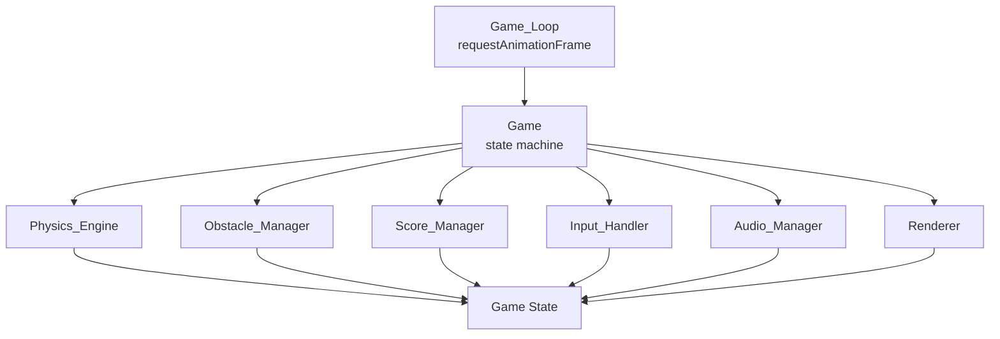
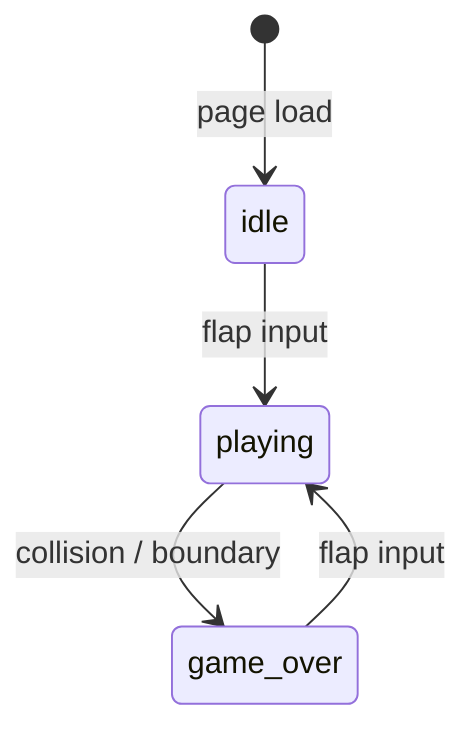

# Design Document: Flappy Kiro

## Overview

Flappy Kiro is a single-file, browser-based endless scroller game implemented in vanilla JavaScript with HTML5 Canvas. The player controls Ghosty, a ghost sprite, by tapping/clicking/pressing spacebar to flap upward against gravity while navigating through pipe gaps and avoiding cloud obstacles. The game features a retro hand-drawn aesthetic, sound effects, and a persistent high score via localStorage.

The entire game lives in a single `index.html` file with no external dependencies. All game logic is organized into discrete component objects (modules) that communicate through a central game state object.

## Architecture

The game follows a component-based architecture within a single HTML file. A central `Game` object owns the game state and orchestrates the `Game_Loop`, which calls `update()` and `render()` on every animation frame.



### Game State Machine



### Frame Lifecycle

Each frame follows this sequence:

1. `Input_Handler` processes queued inputs
2. `Physics_Engine` updates Ghosty position/velocity
3. `Obstacle_Manager` moves obstacles, spawns new ones, despawns off-screen ones
4. `Score_Manager` checks pipe crossing
5. Collision detection runs
6. `Renderer` clears canvas and draws all elements
7. `Game_Loop` schedules next frame via `requestAnimationFrame`

## Components and Interfaces

### Game (Central Coordinator)

Owns the canonical `GameState` object and drives the frame lifecycle.

```js
// Pseudo-interface
Game = {
  state: GameState,
  init(),          // set up canvas, bind components, load assets
  start(),         // transition idle -> playing
  restart(),       // reset state, transition game_over -> playing
  gameOver(),      // transition playing -> game_over, play sound
  update(dt),      // orchestrate per-frame updates
  render(),        // delegate to Renderer
}
```

### Physics_Engine

Stateless functions that mutate the `ghosty` object in `GameState`.

```js
PhysicsEngine = {
  GRAVITY: 0.5,       // px/frame² (scaled)
  FLAP_VELOCITY: -9,  // px/frame (upward, scaled)
  applyGravity(ghosty),
  applyFlap(ghosty),
  clampToBounds(ghosty, canvasHeight, scoreBarHeight),
}
```

### Obstacle_Manager

Manages the arrays of active pipes and clouds.

```js
ObstacleManager = {
  PIPE_INTERVAL: 220,   // px between pipe spawns
  SCROLL_SPEED: 3,      // px/frame (scaled)
  GAP_SIZE: 160,        // px (scaled)
  pipes: [],
  clouds: [],
  update(gameState),
  spawnPipe(gameState),
  spawnCloud(gameState),
  reset(),
}
```

### Score_Manager

Tracks current score and high score.

```js
ScoreManager = {
  score: 0,
  highScore: 0,
  loadHighScore(),      // reads from localStorage
  saveHighScore(),      // writes to localStorage
  checkPipeCrossing(ghosty, pipes),
  incrementScore(),
  reset(),
}
```

### Input_Handler

Listens for keyboard, mouse, and touch events and queues a `flap` action.

```js
InputHandler = {
  pendingFlap: false,
  bind(canvas),         // attach event listeners
  consumeFlap(),        // returns true and clears flag if flap pending
}
```

### Audio_Manager

Wraps the Web Audio API / HTMLAudioElement for sound playback.

```js
AudioManager = {
  jumpSound: Audio,
  gameOverSound: Audio,
  unlocked: false,      // tracks first user gesture
  unlock(),             // called on first interaction
  playJump(),
  playGameOver(),
}
```

### Renderer

All drawing logic. Reads from `GameState` and draws to the Canvas 2D context.

```js
Renderer = {
  ctx: CanvasRenderingContext2D,
  ghostyImg: HTMLImageElement,
  drawBackground(canvas),
  drawGhosty(ghosty),
  drawPipes(pipes, canvas, scoreBarHeight),
  drawClouds(clouds),
  drawScoreBar(canvas, score, highScore),
  drawIdleScreen(canvas),
  drawGameOverScreen(canvas, score),
  render(gameState),
}
```

## Data Models

### GameState

```js
{
  phase: 'idle' | 'playing' | 'game_over',
  canvas: HTMLCanvasElement,
  scoreBarHeight: number,   // fixed px height of bottom bar
  ghosty: Ghosty,
  pipes: Pipe[],
  clouds: Cloud[],
  score: number,
  highScore: number,
  nextPipeX: number,        // x position at which to spawn next pipe
}
```

### Ghosty

```js
{
  x: number,        // fixed horizontal position (center)
  y: number,        // vertical center position
  vy: number,       // vertical velocity (px/frame)
  width: number,    // sprite render width
  height: number,   // sprite render height
}
```

### Pipe

```js
{
  x: number,        // left edge of pipe pair
  gapTop: number,   // y coordinate of top of gap
  gapBottom: number,// y coordinate of bottom of gap
  width: number,    // pipe width
  scored: boolean,  // true once Ghosty has passed this pipe
}
```

### Cloud

```js
{
  x: number,
  y: number,
  width: number,
  height: number,
}
```

### Scaling

All dimension constants are defined as fractions of canvas dimensions and recomputed on resize, ensuring consistent gameplay across viewport sizes.

```js
function getScaledConstants(canvas) {
  const scale = canvas.height / 600; // 600px is the reference height
  return {
    gravity: 0.5 * scale,
    flapVelocity: -9 * scale,
    scrollSpeed: 3 * scale,
    gapSize: 160 * scale,
    pipeWidth: 60 * scale,
    ghostyWidth: 48 * scale,
    ghostyHeight: 48 * scale,
    scoreBarHeight: 48 * scale,
  };
}
```


## Correctness Properties

*A property is a characteristic or behavior that should hold true across all valid executions of a system — essentially, a formal statement about what the system should do. Properties serve as the bridge between human-readable specifications and machine-verifiable correctness guarantees.*

### Property 1: Gravity accumulates velocity and position

*For any* Ghosty with an arbitrary vertical velocity `vy` and position `y`, after one physics frame the new velocity should equal `vy + GRAVITY` and the new position should equal `y + (vy + GRAVITY)`.

**Validates: Requirements 2.1, 2.3**

---

### Property 2: Flap sets upward velocity

*For any* Ghosty state (any `y`, any `vy`), after `applyFlap` is called the vertical velocity should equal `FLAP_VELOCITY` (a fixed negative constant), regardless of the previous velocity.

**Validates: Requirements 2.2, 3.4**

---

### Property 3: Bottom boundary triggers game over

*For any* Ghosty whose `y` position is greater than or equal to `canvasHeight - scoreBarHeight`, the collision/boundary check should return `true` (game over condition).

**Validates: Requirements 2.5, 6.3**

---

### Property 4: Scaled constants maintain proportional ratios

*For any* canvas height `h`, the ratio of each scaled constant (gravity, flapVelocity, scrollSpeed, gapSize, pipeWidth, scoreBarHeight) to `h` should equal the ratio of the corresponding reference constant to the reference height (600px).

**Validates: Requirements 1.4**

---

### Property 5: Pipe gap size is always GAP_SIZE

*For any* spawned pipe, `pipe.gapBottom - pipe.gapTop` should equal `GAP_SIZE` (scaled).

**Validates: Requirements 4.3**

---

### Property 6: Pipe gap is always within safe vertical bounds

*For any* spawned pipe on a canvas of height `h` with score bar height `s`, `pipe.gapTop` should be >= a minimum margin and `pipe.gapBottom` should be <= `h - s - minimum margin`, ensuring Ghosty can always pass through.

**Validates: Requirements 4.4**

---

### Property 7: Pipe spawn interval is regular

*For any* sequence of two or more consecutively spawned pipes, the horizontal distance between their `x` positions should equal `PIPE_INTERVAL` (scaled).

**Validates: Requirements 4.1**

---

### Property 8: All obstacles scroll leftward at SCROLL_SPEED per frame

*For any* active pipe or cloud with position `x`, after one `update` call its new `x` should equal `x - SCROLL_SPEED`.

**Validates: Requirements 4.2, 5.2**

---

### Property 9: Off-screen obstacles are removed after update

*For any* pipe or cloud whose `x + width <= 0`, after one `update` call that obstacle should no longer appear in the active obstacles array.

**Validates: Requirements 4.5, 5.5**

---

### Property 10: AABB collision detection correctness

*For any* two axis-aligned rectangles A and B: if they overlap, `aabbOverlap(A, B)` should return `true`; if they do not overlap (separated on any axis), it should return `false`.

**Validates: Requirements 6.1, 6.2, 6.4**

---

### Property 11: Score increments exactly once per pipe crossing

*For any* pipe that Ghosty has fully passed (ghosty.x > pipe.x + pipe.width) and that has not yet been scored, calling `checkPipeCrossing` should increment the score by exactly 1 and mark the pipe as scored. Calling it again on the same pipe should not increment the score again.

**Validates: Requirements 7.1**

---

### Property 12: Score display format is correct for all values

*For any* non-negative integer score `s` and high score `h`, the score bar render output should contain the substring `"Score: " + s` and `"High: " + h`.

**Validates: Requirements 7.2**

---

### Property 13: High score updates when current score exceeds it

*For any* score `s` and high score `h` where `s > h`, after `checkPipeCrossing` or `incrementScore` the stored high score should equal `s`.

**Validates: Requirements 7.3**

---

### Property 14: High score localStorage round-trip

*For any* non-negative integer high score `h`, after `saveHighScore(h)` followed by `loadHighScore()`, the returned value should equal `h`.

**Validates: Requirements 7.4**

---

### Property 15: Reset clears score but retains high score

*For any* game state with high score `h` and any current score, after `ScoreManager.reset()` the score should be `0` and the high score should still equal `h`.

**Validates: Requirements 7.5**

---

### Property 16: Game over screen contains the final score

*For any* non-negative integer score `s`, the output of `drawGameOverScreen` (or the canvas state after calling it) should contain the value `s`.

**Validates: Requirements 10.4**

---

### Property 17: Full game reset restores initial state

*For any* game state in `game_over` phase (with any pipes, clouds, and Ghosty position), after a flap input triggers restart: the `pipes` array should be empty, the `clouds` array should be empty, Ghosty's `y` should equal the starting position, and `phase` should equal `'playing'`.

**Validates: Requirements 10.5**

---

## Error Handling

### Asset Loading Failures

- If `assets/ghosty.png` fails to load, the Renderer should fall back to drawing a simple ghost shape (filled circle with eyes) so the game remains playable.
- If audio files fail to load, `Audio_Manager` should catch the error silently and disable sound for the session without crashing the game.

### Browser Autoplay Policy

- `Audio_Manager` tracks an `unlocked` flag. Before the first user gesture, all `play()` calls are no-ops. On the first input event, `unlock()` is called, which attempts to resume the AudioContext (if using Web Audio API) or sets `unlocked = true` for HTMLAudioElement-based playback.

### Canvas Resize Edge Cases

- During a resize event, the game pauses the current frame, recomputes all scaled constants, repositions Ghosty proportionally, and rescales all active obstacle positions before resuming.
- If `canvas.width` or `canvas.height` is 0 (e.g., minimized window), the game loop skips the frame.

### localStorage Unavailability

- `Score_Manager` wraps all `localStorage` calls in try/catch. If localStorage is unavailable (private browsing, quota exceeded), the high score degrades gracefully to in-memory only.

### Input Event Deduplication

- `Input_Handler` uses a single `pendingFlap` boolean consumed once per frame, preventing multiple flaps from a single interaction event burst (e.g., simultaneous touchstart + click on mobile).

---

## Testing Strategy

### Dual Testing Approach

Both unit tests and property-based tests are required. They are complementary:

- **Unit tests** verify specific examples, state transitions, edge cases, and integration points.
- **Property-based tests** verify universal correctness across randomly generated inputs.

### Property-Based Testing

**Library**: [fast-check](https://github.com/dubzzz/fast-check) (JavaScript/TypeScript)

Each correctness property from the design document must be implemented as a single property-based test using `fc.assert(fc.property(...))`. Each test must run a minimum of **100 iterations**.

Each test must include a comment tag in the format:

```
// Feature: flappy-kiro, Property N: <property_text>
```

Example:

```js
// Feature: flappy-kiro, Property 1: Gravity accumulates velocity and position
fc.assert(
  fc.property(fc.float(), fc.float(), (y, vy) => {
    const ghosty = { y, vy };
    PhysicsEngine.applyGravity(ghosty);
    return ghosty.vy === vy + PhysicsEngine.GRAVITY &&
           ghosty.y === y + (vy + PhysicsEngine.GRAVITY);
  }),
  { numRuns: 100 }
);
```

### Unit Tests

Unit tests should cover:

- State transitions: idle → playing, playing → game_over, game_over → playing
- Input event mapping: spacebar, click, touchstart each set `pendingFlap = true`
- Audio: `playJump()` called on flap during playing state; `playGameOver()` called on game over
- Audio deferred before first user gesture (8.3)
- Asset fallback: game renders without crashing when ghosty.png fails to load
- localStorage unavailability: high score degrades to in-memory
- Canvas resize: canvas dimensions match window after resize event (1.3)
- Idle screen displayed on init (10.1)
- Game over screen contains "Game Over" text (10.3)

### Test File Structure

```
tests/
  unit/
    physics.test.js
    obstacle_manager.test.js
    score_manager.test.js
    input_handler.test.js
    audio_manager.test.js
    renderer.test.js
    game_states.test.js
  property/
    physics.property.test.js
    obstacle_manager.property.test.js
    score_manager.property.test.js
    collision.property.test.js
    renderer.property.test.js
```

### Coverage Goals

- All 17 correctness properties must have a corresponding property-based test.
- All state transitions must have unit test coverage.
- All error handling paths (asset failure, localStorage failure, audio deferral) must have unit test coverage.
