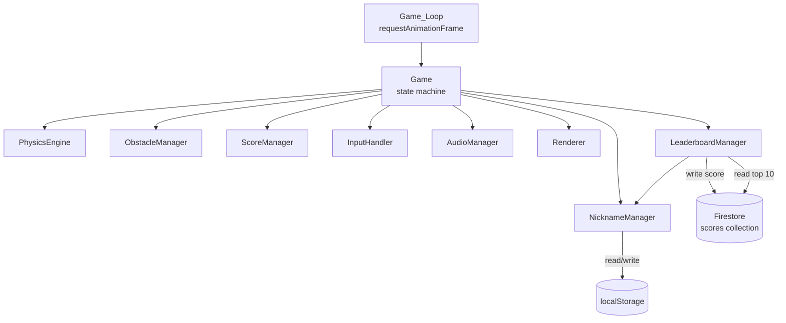
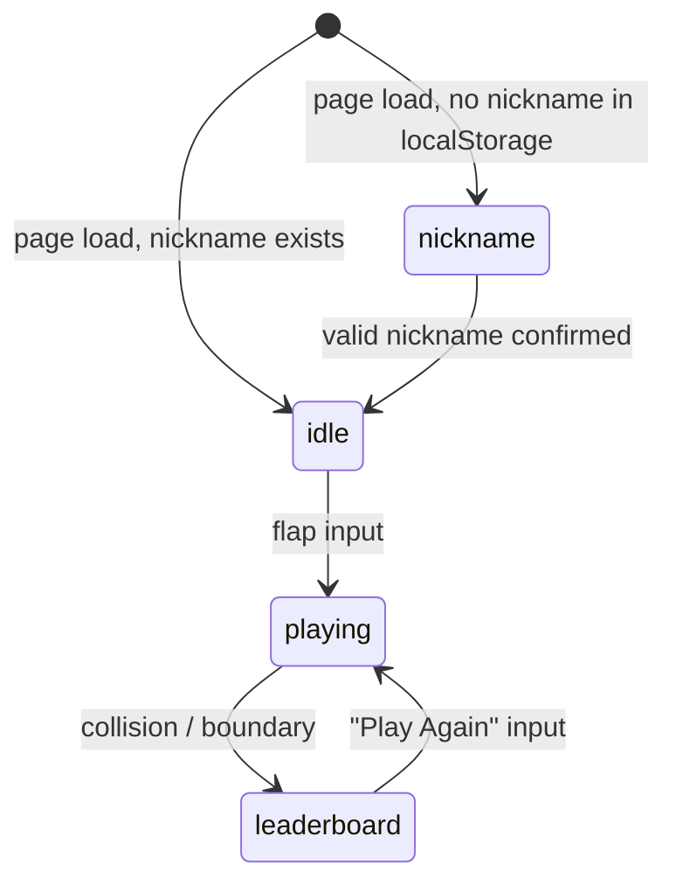

# Design Document: Global Leaderboard

## Overview

The Global Leaderboard feature extends Flappy Kiro with a persistent, cross-player leaderboard backed by Firebase Firestore. Two new components are introduced — `NicknameManager` and `LeaderboardManager` — alongside extensions to the existing `Renderer` and `Game` objects. All Firebase interaction is client-side via the Firebase JavaScript SDK loaded from CDN, consistent with the static GitHub Pages hosting constraint.

The game state machine gains two new phases: `nickname` (shown on first visit before `idle`) and `leaderboard` (shown after `game_over` before allowing restart). The core gameplay loop is unchanged.

## Architecture



### Extended Game State Machine



### Frame Lifecycle (unchanged for playing phase)

1. `InputHandler` processes queued inputs
2. `PhysicsEngine` updates Ghosty position/velocity
3. `ObstacleManager` moves obstacles, spawns/despawns
4. `ScoreManager` checks pipe crossing
5. Collision detection runs
6. `Renderer` clears canvas and draws all elements
7. `Game_Loop` schedules next frame

During `nickname` and `leaderboard` phases, the game loop still runs but only renders the overlay screen; physics and obstacle updates are skipped.

## Components and Interfaces

### NicknameManager

Responsible for prompting, validating, persisting, and retrieving the player's nickname via `localStorage`.

```js
NicknameManager = {
  STORAGE_KEY: 'flappyKiroNickname',
  MAX_LENGTH: 20,

  // Returns the stored nickname or null if not set / localStorage unavailable
  getNickname(),

  // Persists trimmed nickname; returns false if invalid
  saveNickname(raw),

  // Returns true if a valid nickname exists in localStorage
  hasNickname(),

  // Validates a raw string: trimmed length must be 1–20 chars
  validate(raw),   // returns { valid: boolean, error: string | null }
}
```

`NicknameManager` is stateless with respect to the canvas — it only touches `localStorage`. The `Game` object reads `NicknameManager.hasNickname()` at init time to decide whether to enter the `nickname` phase or skip straight to `idle`.

### LeaderboardManager

Responsible for Firebase initialization, score submission, and leaderboard retrieval.

```js
LeaderboardManager = {
  db: null,           // Firestore instance, null if SDK unavailable
  lastEntries: [],    // most recently fetched top-10 entries
  isLoading: false,
  loadError: false,

  // Initialize Firestore; no-op if firebase global is missing
  init(),

  // Submit a ScoreEntry; skips if score === 0 or db is null
  // Returns a Promise that always resolves (never rejects)
  submitScore(nickname, score),

  // Fetch top 10 entries ordered by score desc
  // Resolves with ScoreEntry[] or [] on error/timeout
  // Sets isLoading / loadError flags
  fetchTopScores(),

  // Convenience: submit then fetch; used by Game on game_over transition
  // Returns Promise<ScoreEntry[]>
  submitAndFetch(nickname, score),
}
```

Firebase is initialized once via `LeaderboardManager.init()` called from `Game.init()`. If `window.firebase` is undefined (CDN failed), `db` stays `null` and all operations are silent no-ops.

### Renderer Extensions

Two new drawing methods are added to the existing `Renderer` object:

```js
// Draws the full-screen nickname prompt overlay on the canvas
Renderer.drawNicknameScreen(canvas, errorMessage)
// errorMessage: string | null — shown below the input prompt when validation fails

// Draws the full-screen leaderboard overlay on the canvas
Renderer.drawLeaderboardScreen(canvas, entries, currentScore, currentNickname, isLoading, loadError)
// entries: ScoreEntry[] — top 10 results
// currentScore: number — score from the just-completed session
// currentNickname: string — used to highlight the current player's row
// isLoading: boolean — show loading indicator instead of entries
// loadError: boolean — show error message instead of entries
```

Both methods follow the existing aesthetic: dark semi-transparent overlay (`rgba(0,0,0,0.55)`), white monospace text, retro style consistent with `drawGameOverScreen`.

Because the nickname screen requires text input, a hidden `<input>` element is used for keyboard capture (especially on mobile). The `Renderer.drawNicknameScreen` reads the current value from this input and renders it on the canvas. The input itself is positioned off-screen (`position: absolute; left: -9999px`).

### Game Extensions

`Game.init()` gains:
- Call to `LeaderboardManager.init()`
- Check `NicknameManager.hasNickname()` to set initial phase to `'nickname'` or `'idle'`

`Game.gameOver()` gains:
- Transition to `'leaderboard'` phase instead of `'game_over'`
- Call `LeaderboardManager.submitAndFetch(nickname, score)` asynchronously; re-render when resolved

`Game.update()` gains handling for two new phases:
- `'nickname'`: consume input to confirm nickname; validate and save; transition to `'idle'`
- `'leaderboard'`: consume flap/click/space to restart; call `Game.restart()`

The existing `'game_over'` phase is retired — `'leaderboard'` replaces it entirely.

### CDN Script Tags

Add these two `<script>` tags to `index.html` inside `<head>`, before the game `<script>`:

```html
<script src="https://www.gstatic.com/firebasejs/9.23.0/firebase-app-compat.js"></script>
<script src="https://www.gstatic.com/firebasejs/9.23.0/firebase-firestore-compat.js"></script>
<script src="firebase-config.js"></script>
```

Firebase is initialized inside `LeaderboardManager.init()` using the `firebaseConfig` object loaded from the external `firebase-config.js` file (gitignored):

```js
// firebase-config.js (gitignored — never committed)
const firebaseConfig = {
  apiKey: "YOUR_API_KEY",
  authDomain: "YOUR_PROJECT_ID.firebaseapp.com",
  projectId: "YOUR_PROJECT_ID",
  storageBucket: "YOUR_PROJECT_ID.firebasestorage.app",
  messagingSenderId: "YOUR_MESSAGING_SENDER_ID",
  appId: "YOUR_APP_ID",
};
```

## Data Models

### ScoreEntry (Firestore document in `scores` collection)

```js
{
  nickname:  string,   // player display name, 1–20 chars, trimmed
  score:     number,   // non-negative integer, pipe-crossing count
  timestamp: number,   // Unix epoch milliseconds (Date.now() at submission time)
}
```

Firestore document IDs are auto-generated by `addDoc` / `collection.add()`. No secondary indexes are required — the single query is `orderBy('score', 'desc').limit(10)`.

### GameState (extended)

```js
{
  phase: 'nickname' | 'idle' | 'playing' | 'leaderboard',
  canvas: HTMLCanvasElement,
  scoreBarHeight: number,
  ghosty: Ghosty,
  pipes: Pipe[],
  clouds: Cloud[],
  score: number,
  highScore: number,
  // --- new fields ---
  nickname: string | null,          // current player's nickname
  leaderboardEntries: ScoreEntry[], // last fetched top-10
  leaderboardLoading: boolean,
  leaderboardError: boolean,
  nicknameError: string | null,     // inline validation error for nickname screen
}
```

### NicknameValidationResult

```js
{
  valid: boolean,
  error: string | null,  // e.g. "Nickname cannot be empty" or "Max 20 characters"
}
```


## Correctness Properties

*A property is a characteristic or behavior that should hold true across all valid executions of a system — essentially, a formal statement about what the system should do. Properties serve as the bridge between human-readable specifications and machine-verifiable correctness guarantees.*

### Property 1: Nickname validation accepts exactly the valid length range

*For any* string `s`, `NicknameManager.validate(s)` should return `valid: true` if and only if `s.trim().length` is between 1 and 20 inclusive; for all other strings (empty after trim, or longer than 20 after trim) it should return `valid: false` with a non-null error message.

**Validates: Requirements 2.3, 2.4**

---

### Property 2: Nickname localStorage round-trip

*For any* string `s` where `NicknameManager.validate(s).valid === true`, calling `NicknameManager.saveNickname(s)` followed by `NicknameManager.getNickname()` should return `s.trim()`, and `NicknameManager.hasNickname()` should return `true`.

**Validates: Requirements 2.5, 2.6, 3.1**

---

### Property 3: ScoreEntry always contains all required fields

*For any* valid nickname string `n` and non-negative integer score `s > 0`, the document object produced by `LeaderboardManager.submitScore(n, s)` should contain a `nickname` field equal to `n`, a `score` field equal to `s`, and a `timestamp` field that is a number.

**Validates: Requirements 4.1, 7.1, 7.2, 7.3**

---

### Property 4: Submission timestamp is current

*For any* valid nickname and score, the `timestamp` field in the submitted ScoreEntry should be within 1000ms of `Date.now()` at the time `submitScore` is called.

**Validates: Requirements 7.4**

---

### Property 5: fetchTopScores returns at most 10 entries ordered by score descending

*For any* set of ScoreEntry records in Firestore, `LeaderboardManager.fetchTopScores()` should resolve with an array of at most 10 entries where each entry's `score` is greater than or equal to the next entry's `score` (non-increasing order).

**Validates: Requirements 5.1**

---

### Property 6: Leaderboard screen renders rank, nickname, and score for every entry

*For any* array of ScoreEntry objects (length 0–10), `Renderer.drawLeaderboardScreen` should produce canvas output that contains the rank number, nickname, and score value for each entry in the array.

**Validates: Requirements 6.1**

---

### Property 7: Leaderboard screen highlights the current player's entry

*For any* array of ScoreEntry objects where at least one entry's `nickname` matches `currentNickname`, `Renderer.drawLeaderboardScreen` should render that entry using a visually distinct fill color compared to non-matching entries.

**Validates: Requirements 6.2**

---

### Property 8: Leaderboard screen always shows the current session score

*For any* non-negative integer `currentScore` and any array of leaderboard entries (including an empty array), `Renderer.drawLeaderboardScreen` should produce canvas output that contains the value of `currentScore`.

**Validates: Requirements 6.3**

---

### Property 9: Flap input in leaderboard phase transitions to playing with reset state

*For any* game state in the `leaderboard` phase (with any pipes, clouds, and Ghosty position), after a flap input is consumed: `phase` should equal `'playing'`, the `pipes` array should be empty, the `clouds` array should be empty, and Ghosty's `y` should equal the starting position.

**Validates: Requirements 6.5**

---

### Property 10: Loading indicator is shown while leaderboard is fetching

*For any* canvas dimensions, when `Renderer.drawLeaderboardScreen` is called with `isLoading: true`, the canvas output should contain a loading indicator string and should not render any score entry rows.

**Validates: Requirements 8.3**

---

## Error Handling

### Firebase SDK Not Available

`LeaderboardManager.init()` checks for `typeof window.firebase !== 'undefined'` before calling `firebase.initializeApp()`. If the global is absent, `db` remains `null`. Every subsequent method (`submitScore`, `fetchTopScores`, `submitAndFetch`) checks `if (!this.db) return Promise.resolve([])` and exits silently. No uncaught errors are thrown.

### Firestore Write Failure

`submitScore` wraps the `addDoc` call in a try/catch. On failure it logs to `console.warn` and resolves the returned Promise normally so the caller (`submitAndFetch`) can proceed to fetch.

### Firestore Read Failure / Timeout

`fetchTopScores` wraps the query in a `Promise.race` against a 5-second timeout. On either rejection or timeout it sets `this.loadError = true`, logs to `console.warn`, and resolves with `[]`. The `Leaderboard_Screen` then renders the "Could not load leaderboard" message.

### localStorage Unavailability

`NicknameManager.getNickname()` and `saveNickname()` wrap all `localStorage` calls in try/catch. If unavailable, `getNickname()` returns `null` (triggering the nickname prompt each session) and `saveNickname()` is a silent no-op.

### Zero Score Submission

`submitScore` returns early without writing to Firestore when `score === 0`. This prevents polluting the leaderboard with trivial entries.

### Nickname Input on Mobile

A hidden `<input type="text">` element (positioned off-screen via CSS) is focused when the `nickname` phase begins. This triggers the native mobile keyboard. The canvas reads the input's `.value` each render frame to display the typed text. On confirm, the value is passed to `NicknameManager.saveNickname()`.

---

## Testing Strategy

### Dual Testing Approach

Both unit tests and property-based tests are required and complementary:

- **Unit tests**: specific examples, state transitions, error conditions, integration points
- **Property tests**: universal correctness across randomly generated inputs

### Property-Based Testing

**Library**: [fast-check](https://fast-check.dev/) v3.19+ (already a project devDependency)

Each correctness property from this document must be implemented as a single property-based test using `fc.assert(fc.property(...))`. Each test must run a minimum of **100 iterations**.

Each test must include a comment tag:

```
// Feature: global-leaderboard, Property N: <property_text>
```

Example:

```js
// Feature: global-leaderboard, Property 1: Nickname validation accepts exactly the valid length range
fc.assert(
  fc.property(fc.string(), (s) => {
    const result = NicknameManager.validate(s);
    const trimLen = s.trim().length;
    if (trimLen >= 1 && trimLen <= 20) {
      return result.valid === true && result.error === null;
    } else {
      return result.valid === false && result.error !== null;
    }
  }),
  { numRuns: 100 }
);
```

### Unit Tests

Unit tests should cover:

- `NicknameManager.hasNickname()` returns `false` when localStorage is empty
- `NicknameManager.hasNickname()` returns `true` after a valid save
- `LeaderboardManager.init()` is a no-op when `window.firebase` is undefined
- `LeaderboardManager.submitScore()` skips write when `score === 0`
- `LeaderboardManager.submitScore()` resolves (does not reject) when Firestore throws
- `LeaderboardManager.fetchTopScores()` resolves with `[]` and sets `loadError=true` on Firestore error
- `Renderer.drawLeaderboardScreen()` renders "Could not load leaderboard" when `loadError=true`
- `Renderer.drawLeaderboardScreen()` renders "Play Again" prompt
- Game phase transitions: `nickname → idle`, `playing → leaderboard`, `leaderboard → playing`
- Game state is fully reset when transitioning from `leaderboard` to `playing`

### Test File Structure

New test files to add:

```
tests/
  unit/
    nickname_manager.test.js
    leaderboard_manager.test.js
  property/
    nickname_manager.property.test.js
    leaderboard_manager.property.test.js
    leaderboard_renderer.property.test.js
```

### Coverage Goals

- All 10 correctness properties must have a corresponding property-based test
- All new state transitions must have unit test coverage
- All error handling paths (Firebase unavailable, Firestore failure, localStorage failure, zero score) must have unit test coverage
